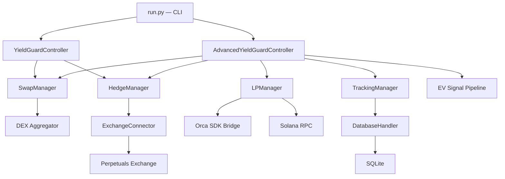
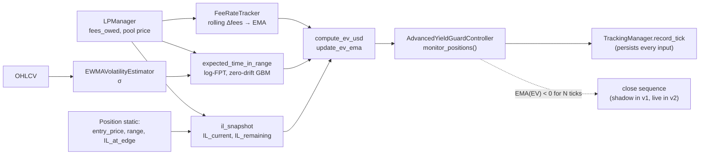
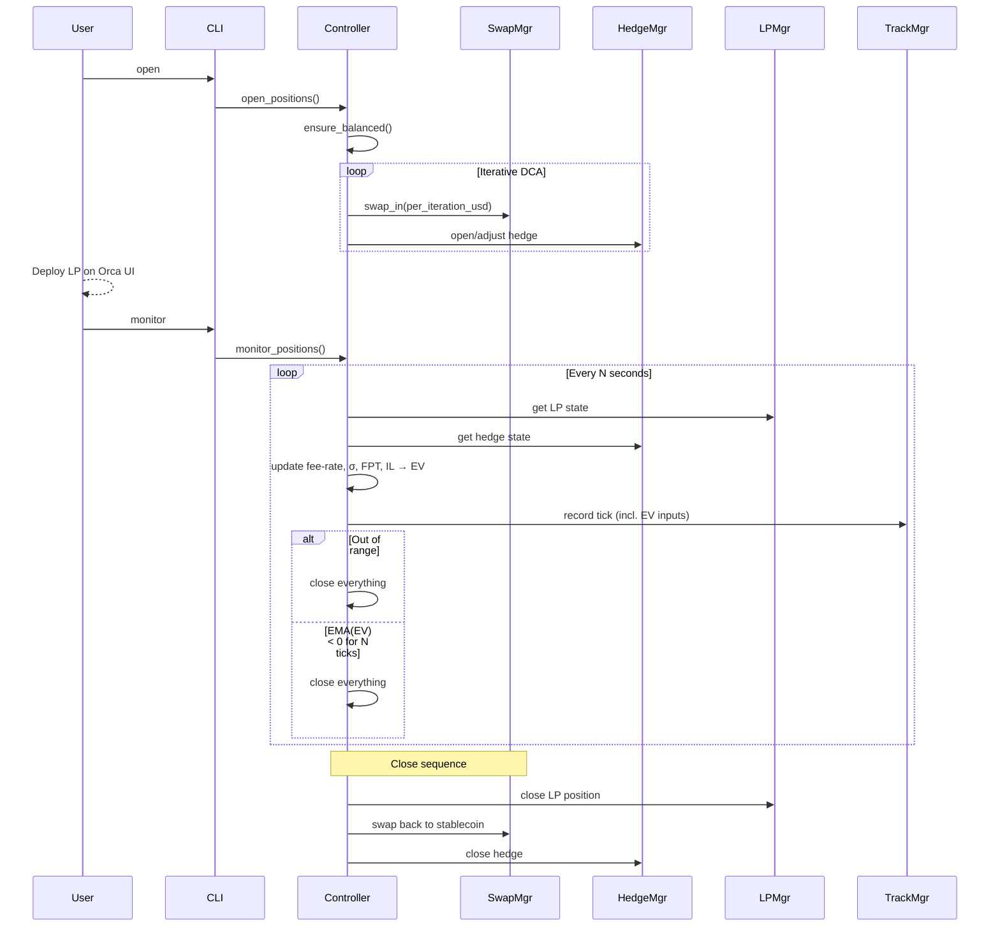

# Yield Guarden

A CLI tool for managing delta-neutral DeFi positions on Solana — capturing LP fees and funding rates while hedging out directional price risk.

The tool operates in two modes, each designed for a different type of yield opportunity.

---

## Simple Mode — Static Delta-Neutral Hedge

For positions with **no impermanent loss exposure** — lending protocols, staking, or stable-pair LPs. The execution is straightforward: buy tokens on-chain, open a matching perpetual short on an exchange, collect yield. No need to worry about IL, volatility, or time in range.

<table>
<tr>
<td></td>
<td></td>
</tr>
<tr>
<td align="center"><em>On-chain long side (Gold LP)</em></td>
<td align="center"><em>Exchange hedge short (Gold perp)</em></td>
</tr>
</table>

### Demo — Opening a Simple Position


---

## Advanced Mode — Concentrated Liquidity (CLMM)

For positions **exposed to impermanent loss** — concentrated liquidity pools on Orca Whirlpools. This is where the real challenge lies and where the system earns its keep.

### The Challenge

DEX concentrated liquidity pools routinely advertise 500%+ APY. What stops people from capturing these yields? Three things:

1. **Directional Price Exposure** — providing liquidity means holding the volatile asset.
2. **Impermanent Loss (IL)** — the non-linear cost of price moving away from your entry. This is the real battle.
3. **LVR (Loss-Versus-Rebalancing)** — a structural cost from arbitrageurs. Largely unavoidable.

Directional risk is neutralized by the short leg. LVR is a cost of doing business. **IL is the free variable — and the exit decision is what determines profitability.**

### Exit Philosophy — From Fixed Take-Profit to an Expected-Value Signal

> *When should a CLMM position be closed?*

Two approaches have been tried:

**v1 — Fixed take-profit (prior approach).** Close when realized `net_pnl` crosses a pre-set USD target. Easy to reason about, but the target is static: it ignores how much fee-rate is accruing *right now*, how much IL budget is still *unspent*, and how much *time* the position is expected to remain in range. Good pools were exited too early; bad ones were held too long.

**v2 — Expected-value signal (current approach).** Treat the exit decision as a forward-looking bet: at every monitoring tick, compare the expected *future* fee revenue against the *remaining* IL budget until the range boundary. Close only when the math turns negative.

$$
\mathrm{EV}_t \ = \ r^{\text{fee}}_t \cdot \mathbb{E}[\tau_{\text{exit}} \mid P_t] \ - \ \bigl(\mathrm{IL}^{\text{edge}} - \mathrm{IL}^{\text{now}}_t\bigr)
$$

where $r^{\text{fee}}_t$ is in USD/min, $\mathbb{E}[\tau_{\text{exit}} \mid P_t]$ in minutes, and the IL term in USD.

- `EV > 0` → future fees are expected to outpace the remaining IL budget. **Stay.**
- `EV < 0` → remaining IL exceeds what fees can cover. **Exit.**

The signal is smoothed with an EMA (α≈0.4) and requires N consecutive negative ticks to trigger, both to filter out single-tick noise from price wicks.

### The Three Live Inputs

Each input is measured from **live on-chain / exchange state** — not from advertised APY or backtest assumptions.

**1. Live fee rate (USD/min)**

Pool APY is averaged across all LPs and all ticks — a poor proxy for this specific position's accrual. Instead, the system snapshots the position's own `fees_owed` every tick, computes a rolling diff over a 30–60 min window, and EMA-smooths it. This is the number that actually matters for the exit decision.

**2. Expected time in range $\mathbb{E}[\tau_{\text{exit}}]$ (minutes)**

Closed-form first-passage time for a zero-drift Brownian motion in log-price, stopped at $[\ln P_{\text{lower}}, \ln P_{\text{upper}}]$:

$$
\mathbb{E}[\tau_{\text{exit}} \mid P_t] \ \approx \ \frac{\bigl(\ln P_{\text{upper}} - \ln P_t\bigr)\cdot\bigl(\ln P_t - \ln P_{\text{lower}}\bigr)}{\sigma^2}
$$

The volatility $\sigma$ is an **EWMA** on log-returns of 15-min OHLCV bars (λ=0.94).

**3. IL budget remaining (USD)**

- $\mathrm{IL}^{\text{edge}}$ — worst-case IL at the range boundary, computed once at position open from the chosen range width (same formula the entry workflow uses).
- $\mathrm{IL}^{\text{now}}_t$ — live IL at current price, approximated from $\Delta p$, the half-range, and the total position size for small drifts.
- $\mathrm{IL}^{\text{remaining}}_t = \mathrm{IL}^{\text{edge}} - \mathrm{IL}^{\text{now}}_t$.

Forward-looking by construction: near entry price the full budget is available; near the edge the budget collapses to zero and the EV signal turns negative automatically.

### Live Output

Every monitoring tick logs all five inputs plus the combined signal, so a broken input is visible before it contaminates the decision:

```
💸 Fee rate:  fees=0.7077 USD, raw=+0.003108 USD/min, ema=+0.006626 USD/min (window=593s/600s, n=10)
📈 EWMA σ (per-min): 9.513e-04
🪓 IL:        now=0.7580 USD, remaining=17.0497 USD (Δpx=+1.45%, half_range=7.03%, total=1012.63)
⏳ FPT:       E[t_remaining]=5192.51 min  (log_up=+0.0544, log_lo=+0.0864, in_range=True)
🎯 EV[shadow]: ev=+17.3535 USD, ev_ema=+24.1981 USD
💰 Net PnL:   net=-3.3127 USD, ema=-2.7966 USD
```

### Deferred Extensions (signal is additive)

The EV formula is intentionally simple for v1. Each extra term is a drop-in addition, not a rewrite:

- **Funding rate** — signed cost on the perp hedge; can flip against the position in strong trends. Drops in as an extra term in EV.
- **LVR (Loss-Versus-Rebalancing)** — the continuous-time cost of the LP's mechanical rebalancing against an informed AMM. Replaces the IL "budget" term for longer holds or higher-vol regimes.
- **GARCH-X(1,1) σ** — upgrade from EWMA. Exogenous variable (`X`) is Hyperliquid perp volume; volume-conditioning is where the real payoff lives (plain GARCH over EWMA is marginal).
- **Monte-Carlo FPT** — p25 / p50 / p75 of exit time under fitted vol, mirroring the quantile style of the entry excursion analysis.
- **Trading cost amortization** — subtract expected close-side hedge + swap fees, amortized over $\mathbb{E}[\tau]$, to discourage over-trading.
- **Opportunity cost** — exit threshold becomes "EV > EV of redeploying elsewhere", not just "EV > 0".

### Exit in Action

<table>
<tr>
<td width="50%"></td>
<td width="50%"></td>
</tr>
<tr>
<td align="center"><em>v1 — fixed TP: CLMM position closed once <code>net_pnl_ema</code> crossed a pre-set USD target.</em></td>
<td align="center"><em>v2 — EV signal: exit when <code>EMA(EV) &lt; 0</code> over N consecutive ticks.</em></td>
</tr>
</table>

---

## Architecture



The system manages two legs of a delta-neutral position simultaneously:

- **Long side (on-chain):** Tokens are swapped and deployed into a yield-bearing protocol — concentrated liquidity pools, lending, or staking.
- **Short side (CEX):** A matching perpetual short is opened on an exchange to neutralize price exposure and earn funding.

Positions are opened and closed iteratively (DCA-style) to minimize slippage and price impact.

### EV Signal Pipeline

Zoomed in on the advanced-mode exit logic:



Every input is persisted per tick — not just the combined signal. The EV formula is a pure function of recorded state, which means the exact live signal can be replayed offline on past tracking data to tune `λ`, `α`, fee-rate window length, and exit-hysteresis N *before* any of them touch a live exit.

---

## Lifecycle — Advanced Mode



---

## Results — Alpha, April 2026

Live trading — battle-testing the system with real capital on USDC-quoted Orca CLMM pools, hedged on Hyperliquid perps.

| Metric | Value |
|---|---|
| Consecutive winning positions | **5 / 5** (100% win rate) |
| Cumulative net PnL | **+$35.87** |
| Allocation per position | $1,000 (fixed unit) |
| Average hold time | ~12h |
| Average net PnL per trade | +$7.17 (≈ **0.72% of deployed capital**, ~12h) |
| Active EV-signal mode | **shadow** — logged and persisted every tick; not yet wired to trigger exits |

**Framing.** Sample size is intentionally small. The EV signal is currently running in shadow mode — its inputs and combined value are logged and persisted on every monitoring tick, but the live exit trigger is still the legacy path (fixed TP + out-of-range). Promotion of EV to a live exit is gated on two things: (1) a replay pass over the persisted SQLite tick history to tune `λ`, `α`, fee-rate window, and exit-hysteresis `N`; (2) a handful of additional shadow trades showing EV crossing zero *before* the fixed-TP or OOR trigger would have fired.

Detailed per-position tick traces are available on request.

---

## Tech Stack

| Layer | Technology |
|-------|------------|
| Language | Python, TypeScript |
| Chain | Solana |
| Swaps | Jupiter Aggregator, Jito bundles |
| LP Protocol | Orca Whirlpools (CLMM) |
| Hedge Exchange | Perpetuals via `ccxt` |
| Volatility | EWMA (`numpy`); GARCH-X on roadmap (`arch`) |
| Data | SQLite, Pandas |
| CLI | Python `cmd` module |

> **Note:** This is a showcase repository. The full source code is in a private repo. The [modules/](modules/) directory contains sanitized class and function signatures to illustrate the system design.
