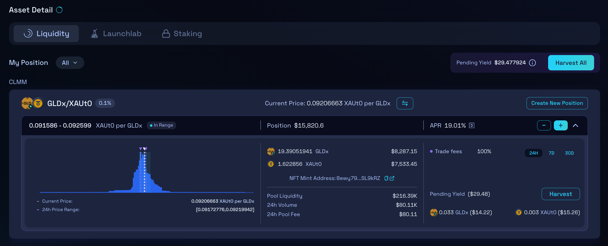
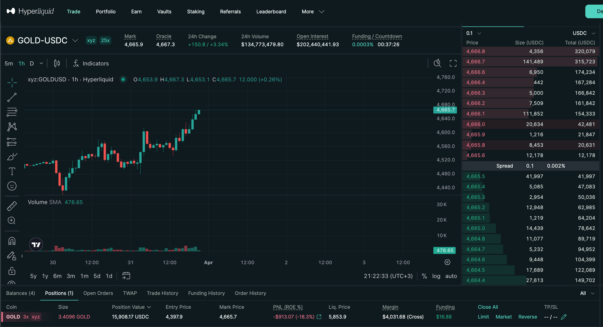
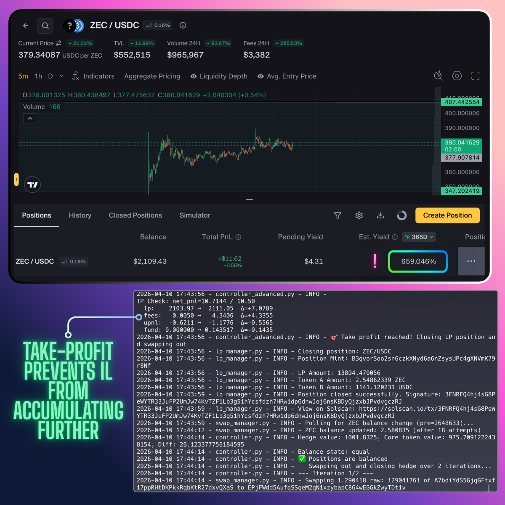
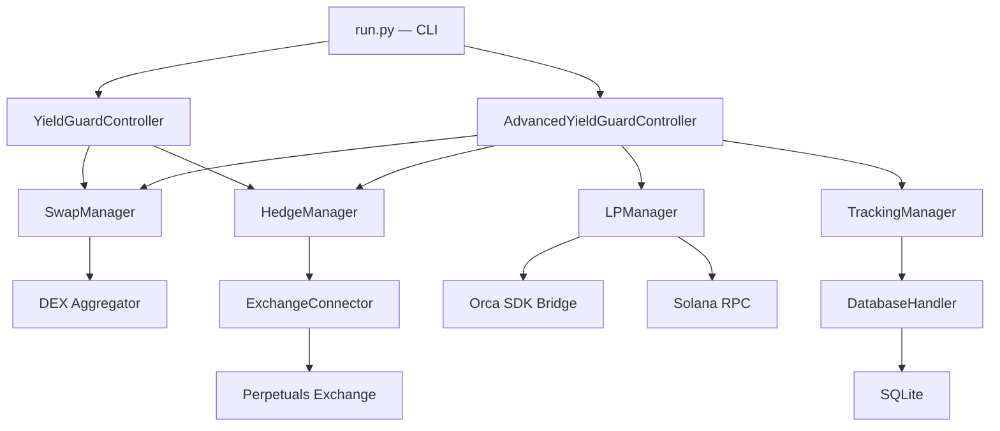
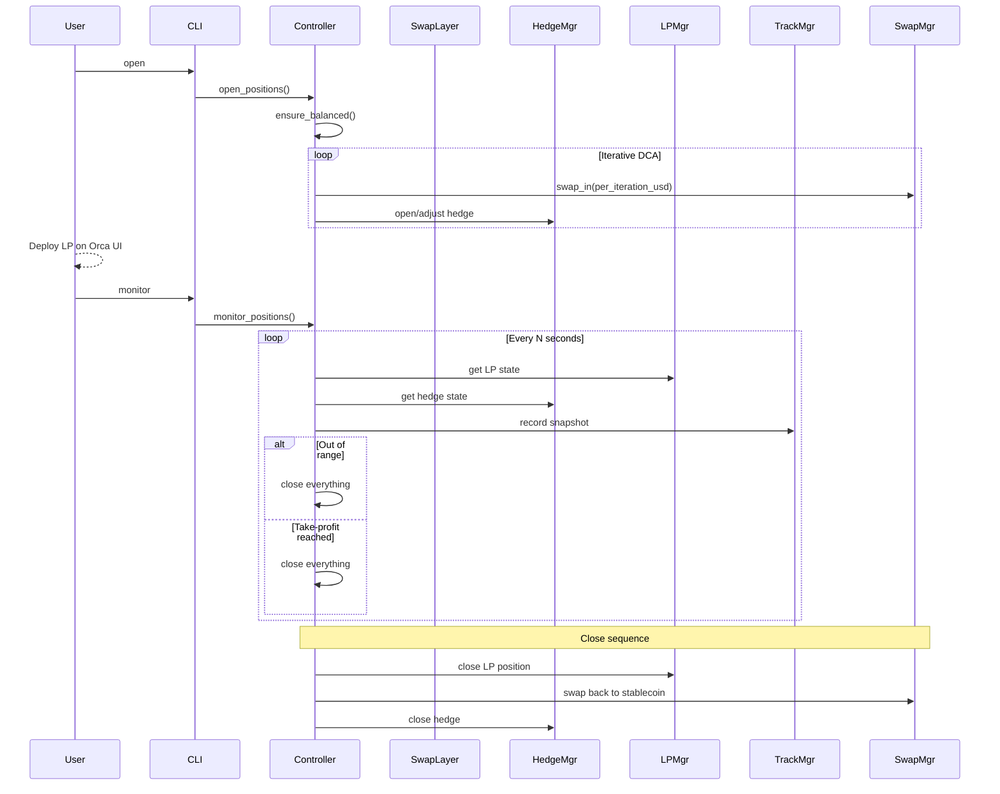

# Yield Guarden

A CLI tool for managing delta-neutral DeFi positions on Solana — capturing LP fees and funding rates while hedging out directional price risk.

The tool operates in two modes, each designed for a different type of yield opportunity.

---

## Simple Mode — Static Delta-Neutral Hedge

For positions with **no impermanent loss exposure** — lending protocols, staking, or stable-pair LPs. The execution is straightforward: buy tokens on-chain, open a matching perpetual short on an exchange, collect yield. No need to worry about IL, volatility, or time in range.

<table>
<tr>
<td></td>
<td></td>
</tr>
<tr>
<td align="center"><em>On-chain long side (Gold LP)</em></td>
<td align="center"><em>Exchange hedge short (Gold perp)</em></td>
</tr>
</table>

### Demo — Opening a Simple Position


---

## Advanced Mode — Concentrated Liquidity (CLMM)

For positions **exposed to impermanent loss** — concentrated liquidity pools on Orca Whirlpools. This is where the real challenge lies and where the system earns its keep.

<p align="center">

</p>
<p align="center"><em>Automated take-profit: CLMM position closed after net PnL target reached</em></p>

### The Challenge

DEX concentrated liquidity pools routinely advertise 500%+ APY. What stops people from capturing these yields? Three things:

1. **Directional Price Exposure** — providing liquidity means holding the volatile asset.
2. **Impermanent Loss (IL)** — the non-linear cost of price moving away from your entry. This is the real battle.
3. **LVR (Loss-Versus-Rebalancing)** — a structural cost from arbitrageurs. Largely unavoidable.

While directional risk is hedged by the short leg and LVR is a cost of doing business, **IL is the variable that determines profitability**.

### Strategy Philosophy

**The core insight:** IL is *impermanent* — if price returns to entry, IL vanishes. High APY means fast fee accumulation, which means costs are covered quickly. The goal is to select pools where:

> *"Time to cover IL fully"* < *"Time the position stays in range"*

This creates a setup where we either close early via take-profit, or the accumulated yield fully covers IL by the time price exits the range.

**The profitability equation:**

```
(Yield + Funding) - (Unrealized IL + Trading Costs) > 0
```

**Execution philosophy — each position follows a structured lifecycle:**

1. **Pool Selection** — scan for high-APY concentrated liquidity pools, filter for hedgeability
2. **Range & Horizon Estimation** — analyze historical volatility to estimate how long a given price range will hold, and whether yield can cover worst-case IL within that window
3. **Strategy Definition** — configure position sizing, hedge parameters, and take-profit target
4. **Execution** — swap into the core token, open the hedge, deploy liquidity into the chosen range
5. **Monitoring** — continuous loop tracking LP state, hedge P&L, fees, and funding in real time
6. **Automated Exit** — close everything when take-profit is reached or price moves out of range

---

## Architecture



The system manages two legs of a delta-neutral position simultaneously:

- **Long side (on-chain):** Tokens are swapped and deployed into a yield-bearing protocol — concentrated liquidity pools, lending, or staking.
- **Short side (CEX):** A matching perpetual short is opened on an exchange to neutralize price exposure and earn funding.

Positions are opened and closed iteratively (DCA-style) to minimize slippage and price impact.

---

## Lifecycle — Advanced Mode



---

## Results

Last 5 consecutive profitable trades (April 2026):

| # | Asset | APY at Entry | Allocation | TP % | Duration | Profit |
|---|-------|-------------|------------|------|----------|--------|
| 1 | ZEC   | 700%        | $1,000     | 0.25%| 12h      | **+$7.00** |
| 2 | MON   | 1,500%      | $1,000     | 0.50%| 12h      | **+$10.00** |
| 3 | PUMP  | 300%        | $1,000     | 0.10%| 14h      | **+$3.40** |
| 4 | MON   | 1,500%      | $1,000     | 0.50%| 13h      | **+$9.33** |
| 5 | ZEC   | 300%        | $1,000     | 0.10%| 10h      | **+$6.14** |

**Total: +$35.87 across 5 trades, 100% win rate, ~12h avg hold time.**

---

## Tech Stack

| Layer | Technology |
|-------|------------|
| Language | Python, TypeScript |
| Chain | Solana |
| Swaps | Jupiter Aggregator, Jito bundles |
| LP Protocol | Orca Whirlpools (CLMM) |
| Hedge Exchange | Perpetuals via `ccxt` |
| Data | SQLite, Pandas |
| CLI | Python `cmd` module |

> **Note:** This is a showcase repository. The full source code is in a private repo. The [modules/](modules/) directory contains sanitized class and method signatures to illustrate the system design.
